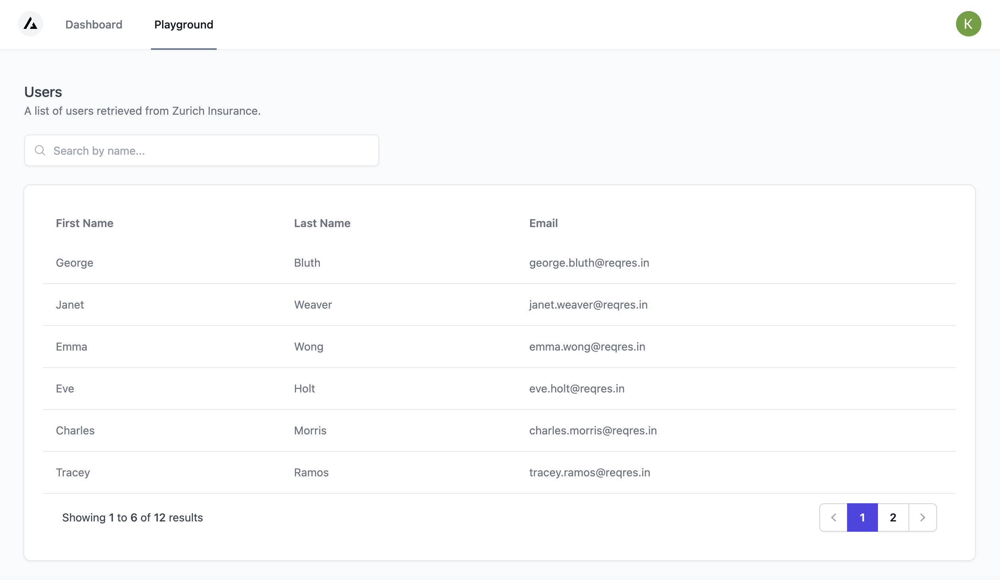
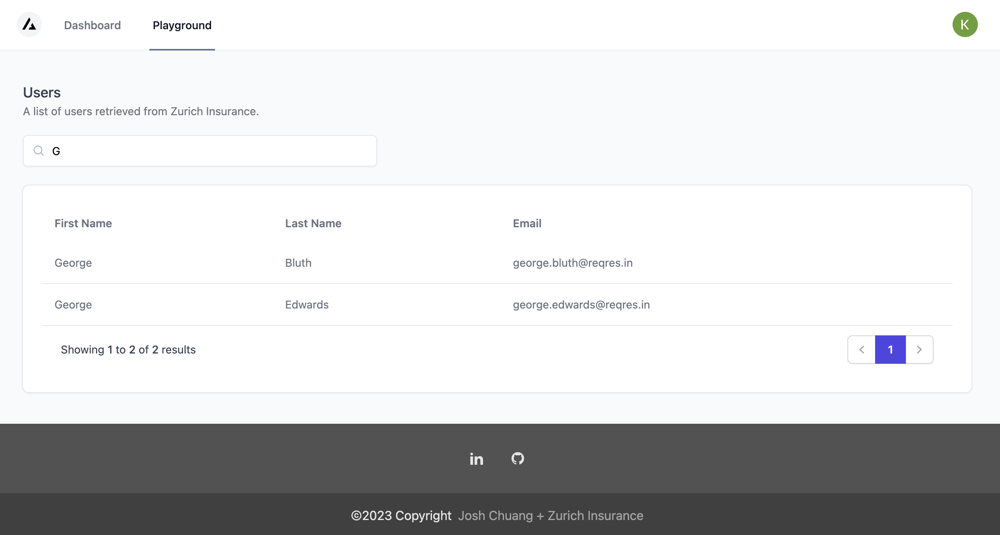

# NextJS + Next Auth Boilerplate

## Packages


---
<div  align="center"><strong>NextJS + Next Auth Boilerplate for Technical Assessment</strong></div>

<div  align="center">Built with the Next.js App Router</div>

## Introduction

🚀 Boilerplate and Starter for Next.js 13+, Next Auth, Tailwind CSS and TypeScript.


## Getting Started

In order to run the server, you're required to create your own `.env.local` file based on the `.env.local.example` file provided. 

### Setup Google API 
1. Visit [https://console.cloud.google.com/](https://console.cloud.google.com/)
2. Click 'New Project' button to create a new project. Otherwise, select the project that you would like to manage.
3. Choose 'APIs & Services' then 'Credentials' on the side menu. 
4. Click 'Create Credentials' button then choose 'OAuth client ID'.
5. For application type, select 'Web Application'.
6. Add 'http://localhost:3000' in the authorized JavaScript origins.
7. Add 'http://localhost:3000/api/auth/callback/google' in the authorized redirect URIs.
8. You should be able to retreive the Client ID and Client Secret for the Google ID and Google Secret respectively in the .env file.

Finally, run the following commands to start the development server:

```
yarn
yarn run dev
```

You should now be able to access the application at http://localhost:3000.

## Result

### Protected Page

The URL `/playground/` is a protected page that is only visible to the users after logged on.



### Filter Record

When 'G' is typed into the input box, the API will search through all pages to get the complete sets of records.


